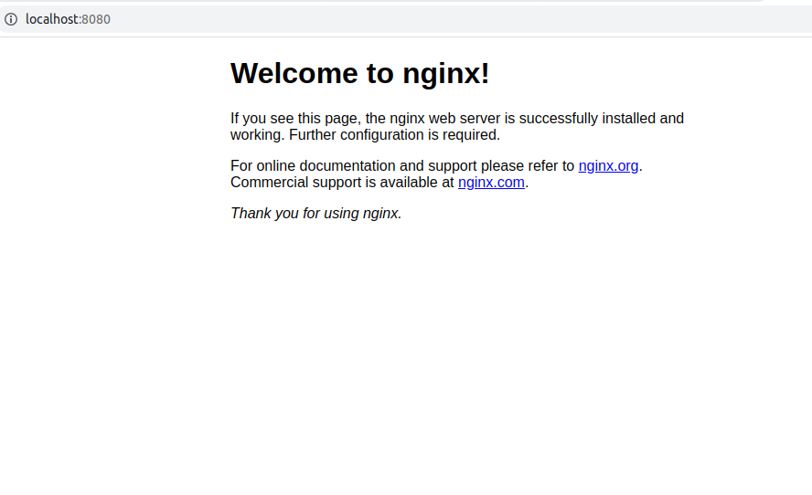
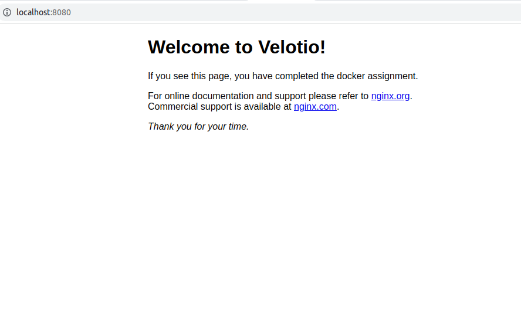
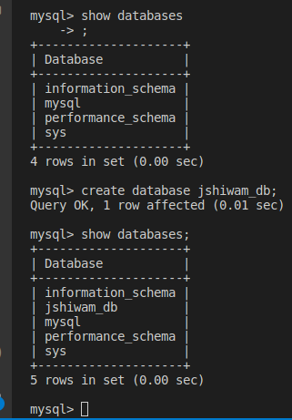
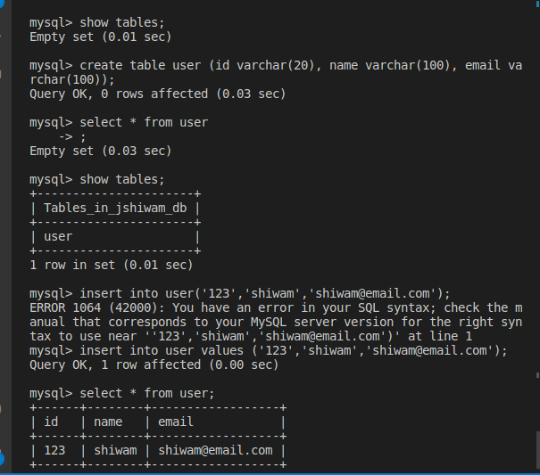
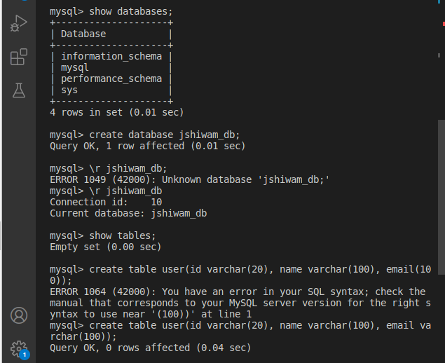
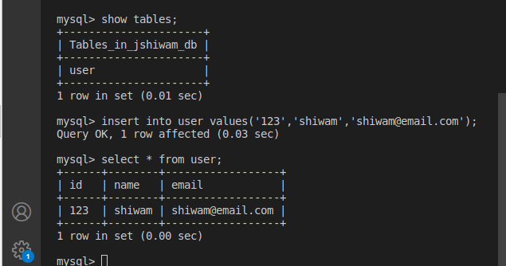
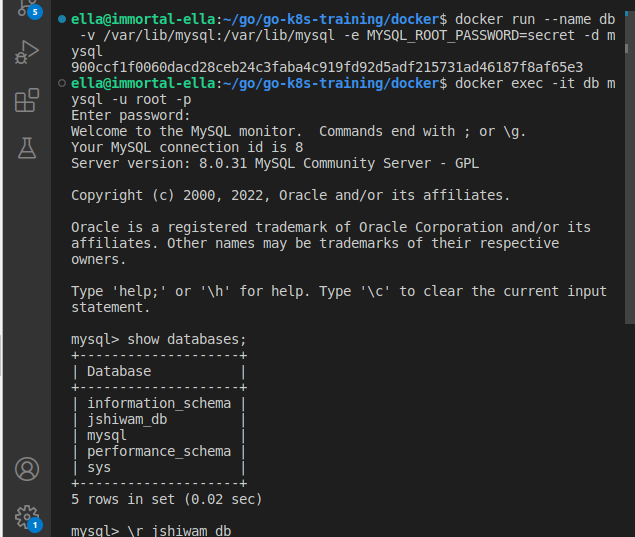
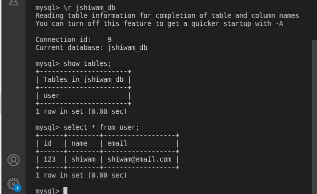
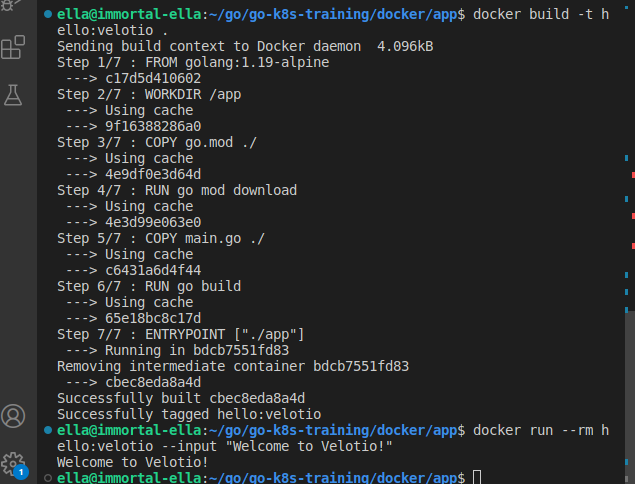

### Run Nginx
- docker run -d -p 8080:80 nginx
- 

### Add Velotio's Page
- docker run -ti -p 8080:80 nginx bash
- - apt-get update
- - apt-get install vi
- - vi /usr/share/nginx/html/index.html
- - change the index.html file
- - exit
- docker commit `container-id` nginx:velotio
- 

### Run MySQL Container

- docker run -d --name db -e MYSQL_ROOT_PASSWORD= mysql

- docker exec -it db mysql -u root -p

- 

- 

- docker run --name db -v /var/lib/mysql:/var/lib/mysql -e MYSQL_ROOT_PASSWORD=secret -d mysql

- 

- 

- 

- 

### Containerised Go app `hello:velotio`

- 

### Push the image to dockerhub

- docker tag hello:velotio jshiwam/hello:velotio
- docker push jshiwam/hello:velotio
```
The push refers to repository [docker.io/jshiwam/hello]
6b17e7c03652: Pushed 
9eed91148abf: Pushed 
4bfaf74c209f: Pushed 
fda5c4cebde5: Pushed 
e6ee11abf060: Pushed 
34a8ca206bdf: Pushed 
5543070dee1f: Pushed 
ded7a220bb05: Pushed 
velotio: digest: sha256:234c6a64275ff2f708e4621b4ee45f43b5ff079337c542296f6a27ff29f47ee3 size: 1989
```
- docker pull jshiwam/hello:velotio
